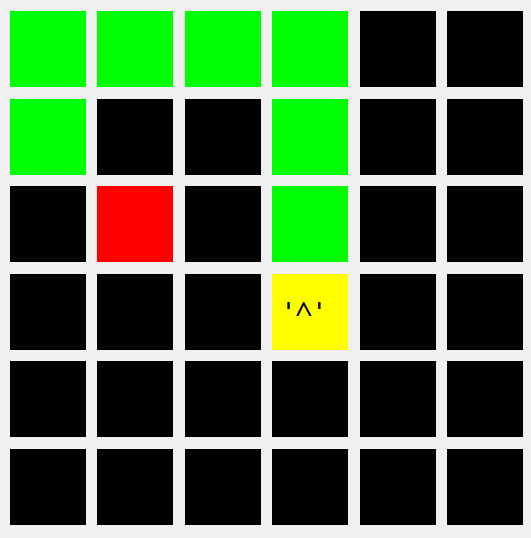

# Snake-Game Version 1.1.0

Snake-Game is a feature-rich C++ implementation of the classic Snake game, leveraging the Qt framework for enhanced visualization. The project consists of two primary components: the core game logic encapsulated in the `Snaky` library and the Qt-based visualization in the `SnakeGame` folder.
## What is new ?

### Note on Performance Enhancement

Previously, the game utilized a simple Qt realization with character printing, necessitating updates to all elements in a `size * size` grid. The recent version, implemented with `QFrame` and `QLabel`, selectively updates only the changed elements, significantly improving efficiency.

The snake's positions in the front end are now managed using a `QList`, a linked list, without relying on the `getSnakePositions` function. This enhances the overall time complexity of the program to $O(1)$.

Users need not worry about optional time complexity improvements. If $O(n)$ is acceptable, the `getSnakePositions` function is always available to simplify front-end development. After an initial version, users can experiment with the linked list $(O(1))$ version for superior time performance.

## Snaky Library

The `Snaky` library contains the game logic and is conveniently included within the Qt source folder. For non-Qt implementations, a dynamic link library (DLL) version is available at `Snake-Game/Snaky/cmake-build-debug/libSnaky.dll`. The library includes the following files:

- `Snaky/Snaky.h`: Header file with the `Snaky` class declaration.
- `Snaky/SnakyImpl.cpp` and `Snaky/SnakyImpl.h`: Implementation files for the `Snaky` class.

### Snaky Class

The `Snaky` class embodies the core game logic, providing methods for controlling the snake's movement, retrieving positions, and managing the game's state. Notable members include static constants for cardinal directions and methods like `turn`, `nextStep`, and `getSnakePositions`.

All backend realizations in the `Snaky` library have a time complexity of $O(1)$, except for the method:

```cpp
void getSnakePositions(int*& positionsArray, int& arrayLength) const {
    // Call an appropriate method in SnakyImpl to get snake positions
    impl.getSnakePositions(positionsArray, arrayLength);
}
```

While this method simplifies access to snake positions, it has a time complexity of $O(n)$, where n is the snake's length. For optimal performance, users are encouraged to avoid using `getSnakePositions`. Instead, creating a linked list in the front end to store positions efficiently manages the snake's position with $O(1)$ complexity.

## SnakeGame Qt Visualization

The Qt visualization of the Snake game is provided in the `SnakeGame` folder. The main application is implemented in the `SnakeGame` class, extending `QGraphicsView`. Key features include handling user input, updating the game state, and displaying the game using the Qt framework.

### SnakeGame Class

The `SnakeGame` class manages the graphical representation of the game using the Qt graphics framework. It includes methods for handling key events, updating the game state, and drawing the scene. Notable features include a timer for continuous updates, initialization functions, and methods for handling game over scenarios.

## Usage

1. Navigate to the Qt source folder containing all the source files.
2. Build the `Snaky` library for non-Qt implementations if needed.
3. Build and run the Qt application using the provided `main` function in `SnakeGame/SnakeGame/main.cpp`.

## Cross-Platform Compatibility

The `Snaky` library is designed to be platform-independent, easily integrating into non-Qt implementations or other languages like C#. The dynamic library (`libSnaky.dll`) provides a seamless way to incorporate the core game logic into various environments.

<div align="center">
  
</div>

## License

Snake-Game is distributed under the [MIT License](LICENSE). Feel free to use it freely, and for any questions or suggestions, please contact the author at mastropseudo@gmail.com.

Feel free to explore and adapt the Snake game to suit your needs, whether in a Qt environment or in other platforms and languages!
